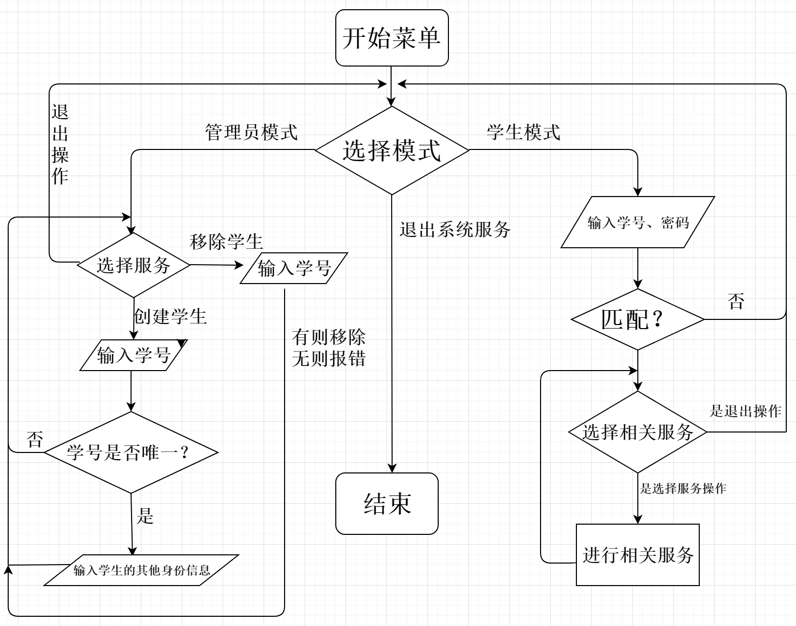
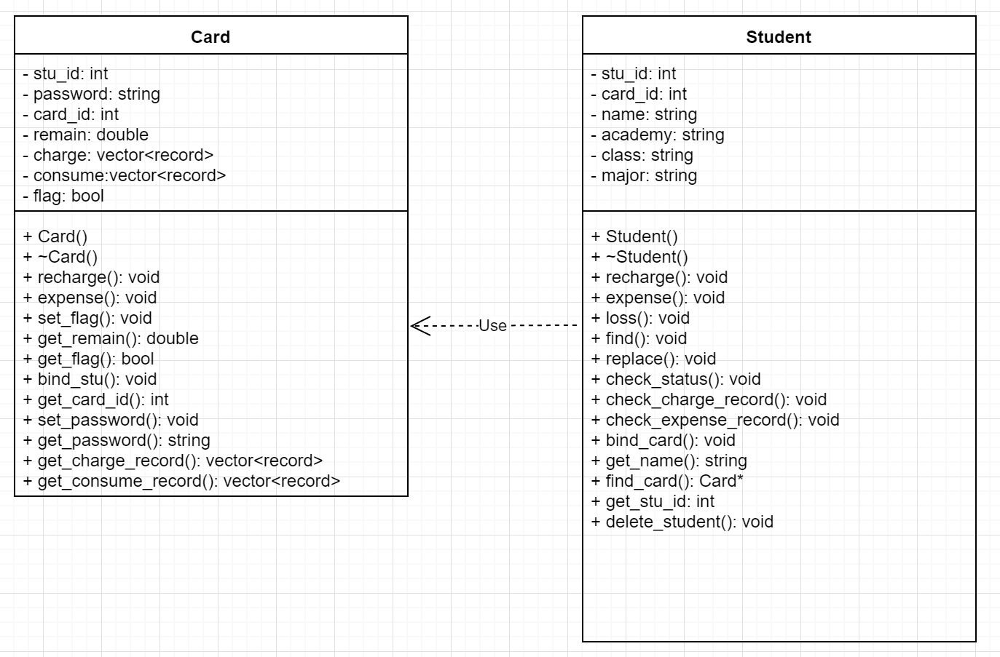
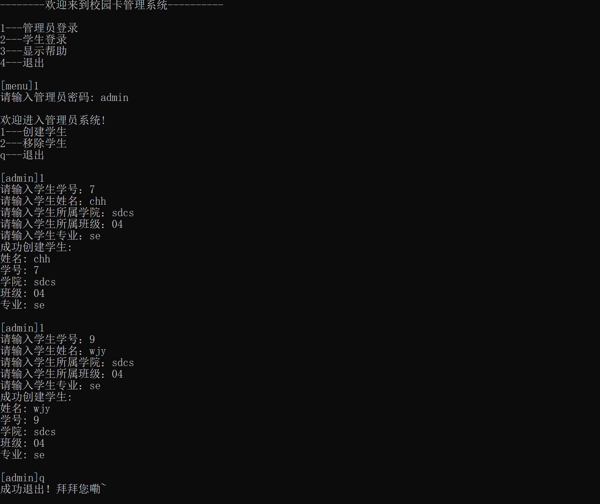
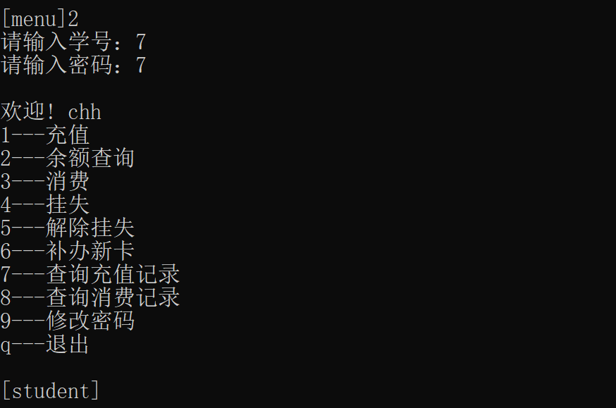
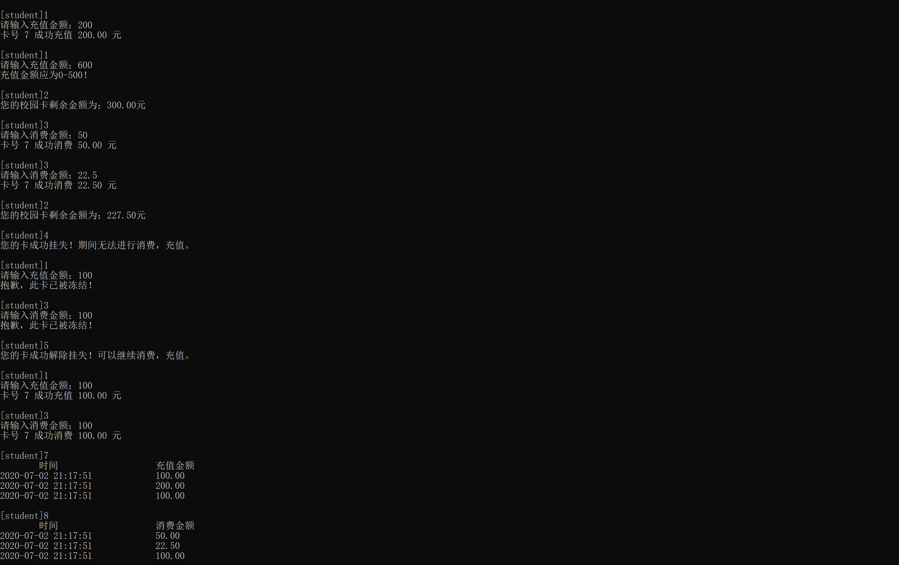
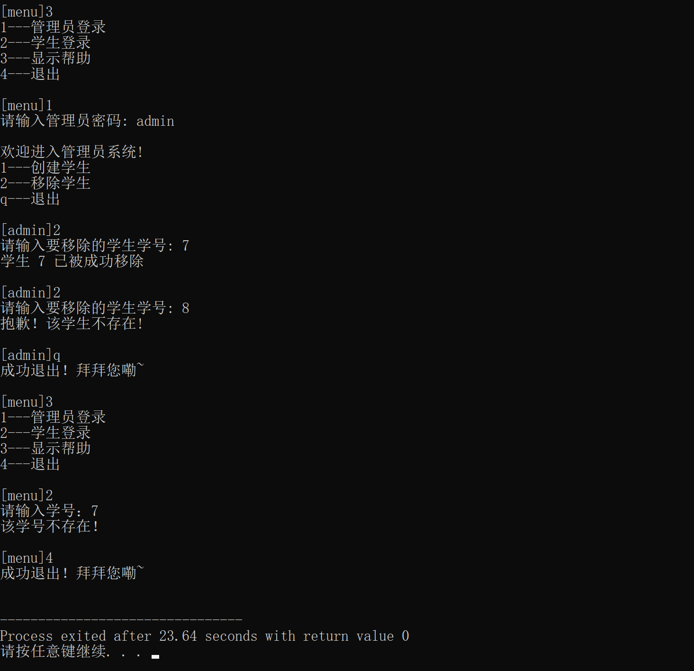

# 校园卡管理项目设计

| 学号 | 姓名 |
| :---: | :----: |
| 17307003 | 陈宏辉 |
| 18324061 | 文君逸 |

## 流程图



## UML类图



## 类间关系

### 学生与卡的绑定

在设计的时候通过两个全局变量**vector\<Student\> students**与**vector\<Card\> cards** 来保存所有已创建的学生和校园卡，将校园卡卡号与学生学号设为相同，利用卡号**card_id**和学号**stu_id**来建立学生和校园卡间的一一映射关系。

### 学生请求校园卡服务

在**Student**类中提供了一系列服务接口，例如查询、充值、消费等等，这些方法会先找到该学生对应的校园卡，然后调用**Card**类中相应的方法，对对应的**Card**实例化的对象进行操作，即对校园卡本身进行操作。对应的操作封装在**Card**类中，操作的条件判断也在**Card**类的方法中进行，在不满足条件的时候将不予执行并输出对应的错误原因。

## 权限选择

在一开始系统启动的界面会提供两种模式：管理员模式和学生模式。

### 管理员模式

管理员可以创建学生并为学生绑定上校园卡，初始密码默认置为和学号相同。如果在输入学号后检测到相同学号的学生已经存在，则不允许继续输入后续的学生信息，若不存在则可继续录入学生的其他信息。    
管理员也可以移除一个学生，如果一个学生不存在则不会被移除并报出错误信息。
在完成上述操作之一后，管理员模式将自动回到管理员模式下的功能选择界面。

### 学生模式

如果选择学生模式，学生需要输入其校园卡卡号和密码。无论是卡号不存在，还是卡号密码不匹配，都会自动退回到模式选择界面。如果匹配之后，会跳转到学生服务界面，学生可以在该界面选择一系列校园卡的服务，包括充值、消费、查看记录、挂失等等。    
学生可以在请求完服务后退出学生模式，系统会给出提示信息并返回模式选择界面。     

## 部分代码实现说明

### 消费、充值记录

对于这个功能我们需要记录两个信息

+ 时间
+ 消费金额

因此我们先定义了一个结构体变量 

``` C++
typedef struct record {
	time_t now;
	double amount;
} record;
```

用来记录这两个信息。以充值为例，在学生的每一次充值动作后，都会记录当前时间和金额，并记录到对应校园卡的**vector**容器中去。实现代码如下：

``` C++
this->_remain += amount;
record tmp;
tmp.now = time(0);
tmp.amount = amount;
_charge.emplace_back(tmp);
```

在输出的时候我们只需要输出结构体内容就可以了。为了避免时间出现个位数的情况，我们在时间为个位数的时候增加前导0来保持表格的整齐。以充值记录为例，输出代码如下：

``` C++
void Student::check_charge_record() {
	puts("\t时间\t\t\t充值金额");
	for (auto i : find_card()->get_charge_record()) {
		tm *ltm = localtime(&i.now);
		printf("%02d-%02d-%02d %02d:%02d:%02d\t\t",1900+ltm->tm_year, 1+ltm->tm_mon, ltm->tm_mday,
											  ltm->tm_hour, ltm->tm_min, ltm->tm_sec); 
		
		printf("%.2lf\n", i.amount);
	}
	puts("");
}
```

### 命令行交互界面

这一部分我们主要采用**switch-case**语句来提供功能选择，并在一开始的**help**界面中显示每一个命令对应的功能选择，在用户输入非法命令的时候报出错误信息并再次显示出**help**界面。输入命令的时候用户还可根据命令行的提示来确定自己当前是在模式选择界面还是在某种模式下。

### 移除学生

在先判断要移除的学生是存在的之后，我们调用 **delete_student()** 方法，这个方法会在学生和校园卡里面同时将目标学号的元素移除，实现时只需要遍历整个学生和校园卡的容器即可。实现代码如下：

``` C++
void Student::delete_student() {
	int temp = _stu_id;

	for(auto i = students.begin(); i != students.end(); i++) {
		if ((*i).get_stu_id() == temp) {
			students.erase(i);
			for (auto j = cards.begin(); j != cards.end(); j++) {
				if ((*j).get_card_id() == temp ) {
					cards.erase(j);
					break;
				}
			}
			break;
		}
	}

}
```


## 系统测试

这一部分我们使用**test**文件来进行主要功能的测试，测试时只需要将测试数据中的文本复制到编译运行的程序中即可。运行结果展示如下(测试数据在**test**目录下的**test.md**文件中)：

### 创建学生测试

这一部分我们创建了两个学生，目的是测试创建学生是否能成功，以及管理员模式能否正常退出。测试结果如下：



### 学生登录测试

这一部分我们输入刚刚创建的学生学号，测试已经被创建的学生能否正常登录，测试结果如下：



### 校园卡服务测试

这一部分我们在刚刚成功登录的基础上测试校园卡的服务功能，重点检查充值、消费以及记录是否正确，校园卡在被冻结后能否消费或者充值。测试结果如下：



### 移除学生测试

这一部分我们重点测试一个不存在的学生能否被移除，以及被移除后的学生能否再次登录。测试结果如下：



## 分工、项目心得

本次项目本小组由组员陈宏辉、文君逸利用**vscode**的**liveshare**功能共同编写代码，然后利用**github**仓库管理代码。在编写完代码之后，由陈宏辉进行测试数据的设计和项目测试，由文君逸进行流程图、UML类图的绘制以及项目说明**README**的撰写，最后两人共同进行项目的debug和实验报告的撰写。    
在本次项目中，我们总结出的经验如下：
+ 1、在编写代码前一定要先设计好相应的类头文件，因为一个方法的实现对于计算机专业的学生并不困难，困难的是设计好不同方法间的关系以及方法的功能专一性，避免后面因修改部分功能而要涉及到大量其他方法。
+ 2、在每编写完一个方法后，都要立即测试一个方法的正确性，而不是等所有方法都编写完后再去测试，这样一个是寻找存在bug的方法非常困难，还可能由于多个方法同时出现的bug混合导致运行时常崩溃或者出现很奇怪的结果。
  
通过这次做项目，让我们对于团队编程该用什么方法、工具，以及分工协作有了新的经验，以及为后续课程的学习提供了很大的帮助。最后对杨老师和两位助教的辛苦工作表示感谢！